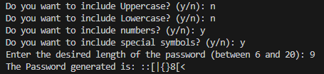

# Password Generator 🔑​
This is a simple password generator written in Java. The application allows the user to customize the password generation by including different combinations of uppercase letters, lowercase letters, numbers and special symbols.

## How it works
The program will ask questions about the user's preferences for generating the password. 
Answer the questions by inserting "y" or "n" as appropriate. 
Next, you will be prompted to enter the desired password length (between 6 and 20).
 
The program will generate a password based on the user's preferences and print it on the console.

## Languages
* Java

## What i used
* [Java](https://dev.java/)
* [JDK](https://www.oracle.com/it/java/technologies/downloads/)

## Installation
First of all, you need JDK (Java Development Kit) installed.
If you don't have it, you can download it here:
[JDK](https://www.oracle.com/it/java/technologies/downloads/) 

### 1 - Clone the repository
`git clone https://github.com/R3ddy95/PasswordGenerator.git`

### 2 - Compilation
Navigate to the root directory of the PasswordGenerator project and compile the code by running the command: 
`javac PasswordGenerator.java`

### 3 - Execution
After compiling, run the program with the command: 
`java PasswordGenerator`

##  License
[MIT](https://choosealicense.com/licenses/mit/)

## Contact Me
My Email: edoardo.vitagliano3@gmail.com  
You can find my Linkedin profile here: https://www.linkedin.com/in/edoardo-vitagliano-299737110/
